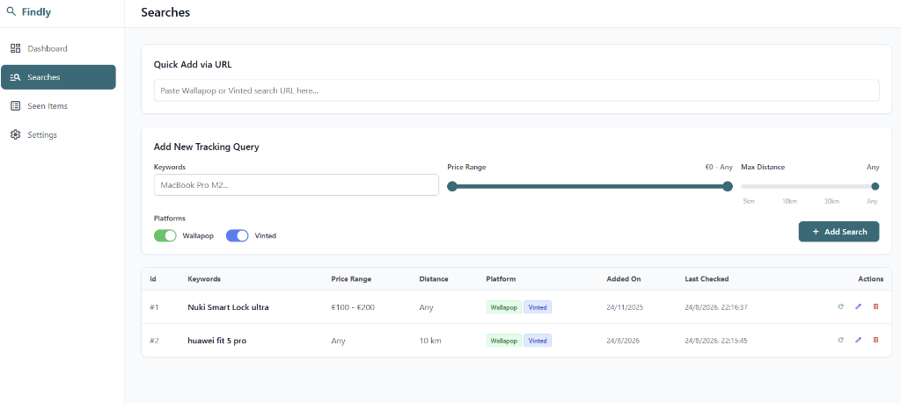

# Findly 🕵️‍♂️

Findly (formerly Wallatrack) is a high-efficiency Telegram bot and Web Dashboard that helps you track items on **Wallapop** and **Vinted** simultaneously. It alerts you via Telegram the moment a new item matching your criteria is posted.



## Features
- **Multi-platform tracking**: Search Wallapop and Vinted.
- **Modern Web UI**: Manage everything from a sleek Single Page Application (Dashboard, Searches, and Settings).
- **Internationalization (i18n)**: The Web Dashboard automatically adapts to English, Spanish, French, Italian, and Portuguese based on your browser's language.
- **Quick Add via URL**: Paste a Wallapop or Vinted URL directly in the Web UI or Telegram to auto-fill the search criteria.
- **Location Geocoding**: Set your exact city or postal code with smart autocomplete. The bot will precisely calculate coordinates globally for localized searches.
- **Item Condition Filter**: Filter results precisely by item condition (New, Mint, Good, Fair, Poor). Findly automatically maps these universal conditions to both Wallapop and Vinted's native category IDs behind the scenes.
- **Easy Telegram Group Pairing**: Connect your Telegram groups to the bot securely with a 5-digit pairing code directly from the Web UI (`/link CODE`), eliminating the need to manually lookup Chat IDs.
- **Unified Broadcasting**: New item alerts are automatically broadcasted to all authorized chats, ensuring your entire team stays updated regardless of who added the tracking query.
- **Anti-ban Resilience (No Proxies needed by default)**:
  - **User-Agent Spoofing**: Automatic rotation of real browser user-agents.
  - **Cookie Warming**: Background ghost requests to bypass initial security checks.
  - **Auto-Retries**: Automatic session reset and retry logic when API endpoints return 401/403 blocks.
  - **Smart Jitter**: Randomized polling intervals to avoid detectable automated patterns.
  - **Strict Vinted Filtering**: Ignores sponsored/zombie items by reading internal high-resolution timestamps.
- **Asynchronous Queues**: The scraping loop is decoupled from Telegram notifications, ensuring lightning-fast scans even if Telegram rate limits are hit.
- **Inline Management**: Unfollow searches directly from the Telegram notification using inline buttons.

## Installation via Docker Hub (Recommended)

Findly is available as a pre-built Docker image at [`uniextra/findly`](https://hub.docker.com/r/uniextra/findly). You do not need to clone the repository to run it.

Simply create a `docker-compose.yml` file anywhere on your server:

```yaml
services:
  findly:
    image: uniextra/findly:latest
    container_name: findly
    init: true
    restart: unless-stopped
    ports:
      - "8000:8000"
    volumes:
      - ./data:/app/data
```

Then run:
```bash
docker-compose up -d
```

*(To change the Web UI port, change the left-side number in `ports`, e.g., `"8080:8000"`).*

## Setup Instructions (Build from source)

If you prefer to build the image yourself or modify the code:

1. Clone this repository.
2. Run with Docker Compose (No `.env` file required!):

```bash
docker-compose up -d --build
```

## First Time Configuration

1. Navigate to the Web UI at `http://localhost:8000` (or your server's IP/custom port).
2. Go to the **Settings** tab.
3. Configure your **Telegram Bot Token**.
4. Use the **Add Chat ID** wizard to easily authorize your private chat or Telegram groups using a pairing code.
5. Click **Save Settings**. The bot will seamlessly reload with your new settings.

## Usage

**Via Web UI (Recommended)**:
Navigate to your dashboard to view statistics, add new tracking queries (using the non-linear sliders or URL pasting), trigger manual refreshes, and manage your settings.

**Via Telegram**:
- `/start` to see the welcome message.
- `/add <keywords> [min_price] [max_price] [distance_in_km]`
- Paste a Wallapop or Vinted URL directly in the chat to track it.
- `/list` to view your active searches.
- `/delete <id>` to remove a search.
